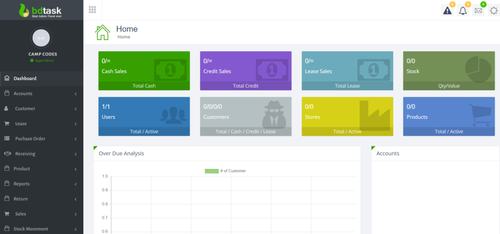
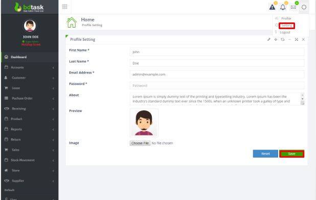
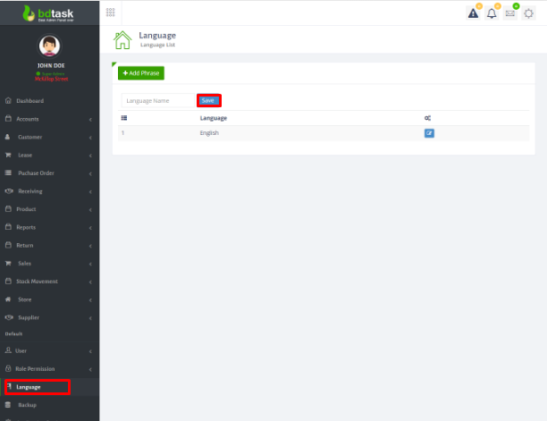
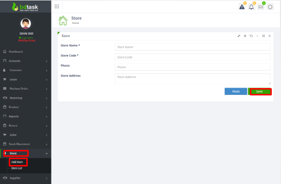
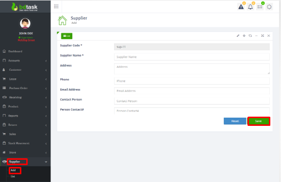

# Multi-Store Inventory Management System

A full-stack web application to manage inventory, sales, suppliers, and financial reports across multiple retail stores. Built using PHP (CodeIgniter), MySQL, Bootstrap, and AJAX.

---

## 🔑 Features

- Role-based dashboards: Super Admin, Store Manager, Purchase User, Pricing User
- Real-time stock tracking, product management, returns, and barcode integration
- Supplier and customer modules with full transaction history
- Financial reports: Profit & Loss, Trial Balance, General Ledger, Cash/Bank Book
- Secure login system with XSS, CSRF, and SQL injection protection

---

## 📦 Modules Overview

### 1. Dashboard Overview  
Displays today’s sales and purchase summary. Product-wise daily report is also visible.  

### 2. Profile Settings  
Click the top-right settings icon to update user details, email, password, and preferences.  

### 3. Application Settings  
Change application title, contact info, favicon, logo, language, and UI alignment.  

### 4. Language Settings  
Add or manage native languages for the platform from `Language > Add Language`.  

### 5. Add Store Module  
First, create a store from `Store > Add Store`. Enables other modules like supplier and inventory.  

### 6. Add Supplier Module  
Register suppliers from `Supplier > Add`. Attach to specific stores with detailed info.  

> ✅ And many more modules including product returns, barcode scanning, stock movement, and financial analytics!

---

## 💻 Tech Stack

- **Frontend:** Bootstrap, HTML, CSS, JavaScript, jQuery, AJAX  
- **Backend:** PHP (CodeIgniter)  
- **Database:** MySQL  
- **Other:** XAMPP/WAMP, PDF generation, Barcode scanning

---

## 🚀 How to Run Locally

1. Clone or download this repo
2. Place the project inside `htdocs/` (XAMPP) or `www/` (WAMP)
3. Create a database and import the SQL file from `/install/install.sql`
4. Run the app: `http://localhost/multistore_main`
5. Login:  
   - **Username:** `admin@example.com`  
   - **Password:** `12345` (change after login)

---

## 🧠 Author

Tejas Subhash Jundre  
[LinkedIn](https://www.linkedin.com/in/tejas-jundre-909302259)  
[GitHub](https://github.com/tejasjundre)

---

